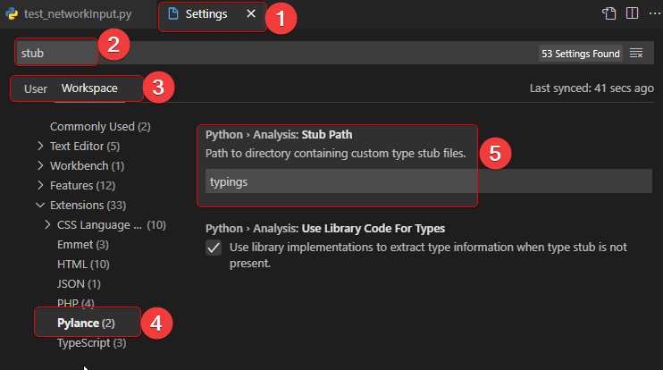

# pyofw


Python package for OpenFlowsWater module from Bentley that mainly contains the stub (*.pyi) files and a few py files to get started.

## Must Create python.exe.config File [**NOT** needed for 10.4 or higher]

Bentley's WaterObjects.NET API contains a mixed mode (managed/unmanaged)
assemblies as a result, a python configuration file has to placed where the python.exe is location (in your environment). The contents of the file can be copied from below or use from [here](/misc/python.exe.config).

>**Note:** Filename is important. For "python.exe" create "python.exe.config"

```xml
<?xml version="1.0"?>
<configuration>
  <startup useLegacyV2RuntimeActivationPolicy="true">
    <supportedRuntime version="v4.0" sku=".NETFramework,Version=v4.0"/>
  </startup>
</configuration>
````

## Installation

Run the following to install:

```python
pip install pyofw
```

**Failed to install?** One of the requirements package is `pythonnet` which might not get installed directly. In such case, follow the steps [how to install pythonnet](#how-to-install-pythonnet).

 **Note:** The package itself will not add any value without the [Bentley's](https://www.bentley.com/en) OpenFlows application like [WaterGEMS](https://www.bentley.com/en/products/product-line/hydraulics-and-hydrology-software/watergems), or [WaterCAD](https://www.bentley.com/en/products/product-line/hydraulics-and-hydrology-software/watercad). And the package assumes the application is installed at the default location. For WaterGEMS it is `C:\Program Files (x86)\Bentley\WaterGEMS\x64`.

## Usage

```python
# -------------------- VERY FIRST STEP ---------------------
# | Navigate to the folder where you are about to create your *.py files
# | In this folder/workspace, bring up the console/terminal and run: 
# | newofw
# | --------------------------------------------------------
# | Above command will add "typings" folder to the workspace
# | then ONLY the IntelliSense will work
# | --------------------------------------------------------


from pyofw.config import OFWConfig

config = OFWConfig() # by default, prepare things for WaterGEMS

model = config.open_model(
         r"C:\Program Files (x86)\Bentley\WaterGEMS\Samples\Example5.wtg")

print(f"Active scenario is: {model.ActiveScenario.Label}")
print(f"And there are '{model.Scenarios.Count}' scenarios in the '{model}' model")

config.end_session() # close the model and end the session
```

## 'newofw' command is showing error?

Are you getting errors like below?

* newofw : The term 'newofw' is not recognized as the name of a cmdlet
* 'newofw' is not recognized as an internal or external command

This could be possible depending on how python is installed. To troubleshoot, make sure you are using the right python.exe. 

1. Find out where the python.exe is. Run `where python` in the console. This will display the full path of the python.exe. **Note** The `where python` command will not give any results in PowerShell terminal. In PowerShell, the command is `Get-Command python`.
   > D:\SDK\python\3_10\python.exe
2. Modify the path like the below:
   > D:\SDK\python\3_10\Scripts\newofw.exe
3. Check if the above file `newofw.exe` exists. 
   1. Does **NOT** exists: reinstall the module again by running `python -m pip install pyofw`
   2. **Exits**: run the exe from the command line. Make sure to be in the right directory.
      >  D:\My\Correct\Folder> `D:\SDK\python\3_10\Scripts\newofw.exe`

## IntelliSense not working?

For IntelliSense to work properly, we have to make sure certain settings are configured properly. 

### VSCode IDE

If VSCode is the IDE of choice,

* Press <kbd>Ctrl</kbd> + <kbd>Shift</kbd> + <kbd>P</kbd> and type in `Settings`.
* Select `Preferences: Open User[/Workspace] Settings`, which will open up the Settings.
* In the search type, `stub`
* Either on User or Workspace tab, select `pylance`
* Under `Python • Analysis: Stub Path`, make sure `typings` is selected



## How to install pythonnet?

> `pythonnet` may not get installed by `pip install pythonnet` as a result follow this alternative.

### Common Error message

> ERROR: Could not build wheels for pythonnet which use PEP 517 and cannot be installed directly

#### Steps to install pythonnet

1. Download the wheel file from <https://www.lfd.uci.edu/~gohlke/pythonlibs/#pythonnet>
   1. For 3.9 version of python, on windows, download **`pythonnet-2.5.2-cp39-cp39-win_amd64.whl`**.
2. run `pip install "path\to\the\downloaded\pythonnet.whl"`
3. Test if pythonnet got installed. If `import clr` doesn't return any error then `pythonnet` is ready to use

   ```powershell
   c:\>python
    Python 3.9.2 (tags/v3.9.2:1a79785, Feb 19 2021, 13:44:55) [MSC v.1928 64 bit (AMD64)] on win32
    Type "help", "copyright", "credits" or "license" for more information.
    >>> import clr
    >>>
   ```

## ERROR at Run Time?

### clr ERROR

>`AttributeError: module 'clr' has no attribute 'AddReference'`
> error that most likely due the installed package called `clr`. Simply uninstall this package and the error should go away.
>`pip uninstall clr`

### No module named 'OpenFlows'

>`ModuleNotFoundError: No module named 'OpenFlows'`
>Make sure the OpenFlows*.dll files are in the x64 directory of the Water products
>You could also pass in the custom location `ofw_config = OpenFlowsWaterConfig(dlls_dir="C:\Path\To\WaterGEMS\x64")`

## More Examples

### py Files

1. Very minimal with no comments:
[Example_Minimal](/src/pyofw/template/example_minimal.py)

1. **[Recommended]** Good example to get started:
[Example_with_comments](src/pyofw/template/example_with_comments.py)

1. Example with minimal uses of `pyofw` module:
[Similar to .NET](example/load_openflows_dlls.py)

### Jupyter Notebook (DataFrames for Elements)

For more details, navigate to [Network Input Notebook](example/notebook/networkInputDFs.ipynb)

```py
from pyofw.network_input import NetworkInput
ni: NetworkInput = NetworkInput(model)

# Links
ni.pipe_df.head(2)
ni.lateral_df.head(2)

# Nodes
ni.junction_df.head(2)
ni.hydrant_df.head(2)
ni.tank_df.head(2)
ni.reservoir_df.head(2)
ni.tap_df.head(2)
ni.pump_df.head(2)
ni.customer_meter_df.head(2)
ni.scada_elem_df.head(2)
ni.pump_stn_df.head(2)
ni.vspb_df.head(2)

ni.prv_df.head(2)
ni.psv_df.head(2)
ni.pbv_df.head(2)
ni.fcv_df.head(2)
ni.tcv_df.head(2)
ni.pbv_df.head(2)
ni.iso_valve_df.head(2)

ni.hydro_tank_df.head(2)
ni.check_valve_df.head(2)
```


### Jupyter Notebook Showing Results

Please navigate to: [Getting_Started](src/pyofw/template/Getting_Started.ipynb).
This notebook also shows some charts using `plotly` library. A few of Images..

#### Tank Level and Pump Flows (using secondary axis)


#### Tank Level and Pump Flows (just like in WaterGEMS)


#### Network display (using networkx module)

